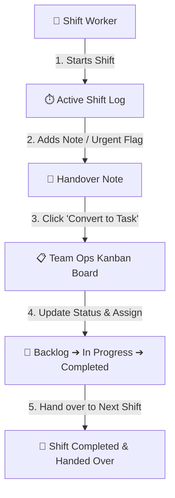
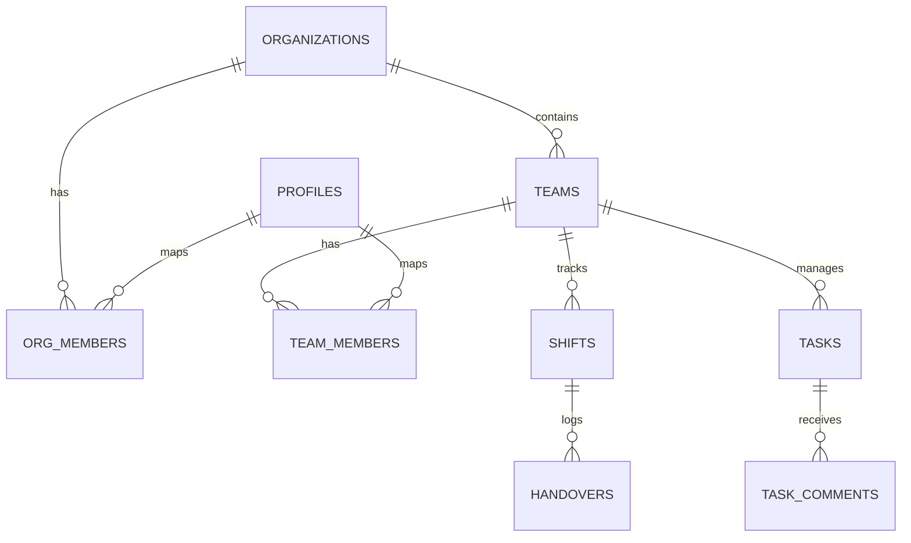

# Balito - Shift Handover & Operations Kanban Platform

> A modern, real-time shift handover tool and Agile operations task board built for 24/7 operations, manufacturing facilities, workshops, and team handovers.

---

## 📐 Operations Workflow



---

## 📊 Database Architecture (ERD)



---

## ✨ Features

- 📋 **Ops Kanban Board (`/org/[id]/team/[teamId]/board`)**
  - 5 Operations-focused columns: `Backlog`, `To Do`, `In Progress`, `Pending Handover`, and `Completed`.
  - Color-coded priority badges (`Urgent` 🔴, `High` 🟠, `Normal` 🔵, `Low` ⚪).
  - Search bar and priority filtering.
  - Quick 1-click status transitions on cards.
  - Task details modal with discussion/comment threads.

- 🔄 **1-Click Handover ➔ Task Escalation**
  - Convert any handover note or urgent flag directly into a Kanban task so action items are never lost across shift boundaries.

- ⏱️ **Shift & Handover Tracking**
  - Clock in/out with automatic timestamps.
  - Log shift status, machine conditions, and mark urgent issues.

- 🏢 **Multi-Tenancy & Access Control**
  - Organization and Team isolation.
  - Recursion-free Row Level Security (RLS) using Security Definer helper functions in Supabase PostgreSQL.

- 🔑 **Browser Autofill & Password Manager Ready**
  - Standard HTML form semantics (`autoComplete`, `name`, `id` attributes) for 1Password, Bitwarden, LastPass, Chrome, and Edge integration.

---

## 🛠️ Tech Stack

- **Framework:** Next.js 16 (Turbopack, App Router)
- **Database:** Supabase (PostgreSQL with RLS & Triggers)
- **Authentication:** Supabase Auth & Public Profiles
- **Styling:** Tailwind CSS (Modern Slate & Glass Design)

---

## 🚀 Getting Started

### 1. Prerequisites & Environment Setup

Copy `.env.local.example` to `.env.local` and fill in your Supabase credentials:

```bash
NEXT_PUBLIC_SUPABASE_URL=https://your-project.supabase.co
NEXT_PUBLIC_SUPABASE_ANON_KEY=your-anon-key-here
```

### 2. Set Up Database

1. Open your [Supabase Dashboard](https://supabase.com) and navigate to the **SQL Editor**.
2. Copy the full contents of `supabase/schema.sql`.
3. Click **Run** to generate all tables (`organizations`, `teams`, `shifts`, `handovers`, `tasks`, `task_comments`, `profiles`), security definer helper functions, and RLS policies.

### 3. Run Development Server

```bash
npm install
npm run dev
```

Open [http://localhost:3000](http://localhost:3000) in your browser.

---

## 📦 Deployment (Vercel)

1. Push your repository to GitHub.
2. Import the project in [Vercel](https://vercel.com).
3. Set `NEXT_PUBLIC_SUPABASE_URL` and `NEXT_PUBLIC_SUPABASE_ANON_KEY` in environment variables.
4. Deploy!
